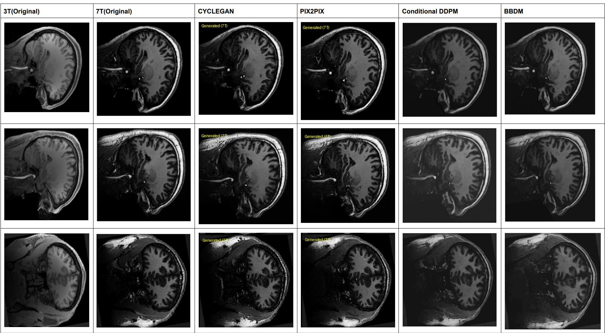
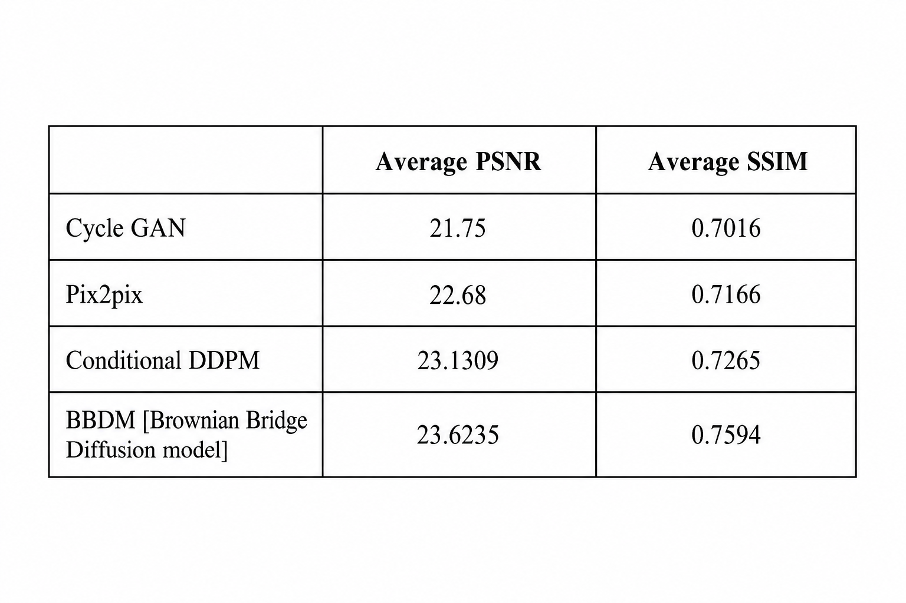

# 3T MRI to 7T MRI Translation using Pix2Pix, CycleGAN, Conditional LDM and BBDM

## Overview

This project focuses on translating low-field strength 3T MRI brain scans into high-field strength 7T MRI scans using multiple image-to-image translation models.

The objective is to compare GAN-based and Diffusion-based approaches for MRI enhancement and evaluate their ability to generate anatomically accurate 7T MRI images.

---

# Results Table

The complete comparison table containing:

* Original 3T MRI
* Ground Truth 7T MRI
* CycleGAN Output
* Pix2Pix Output
* Conditional DDPM Output
* BBDM Output

📄 **Results Table**

  

---

# Quantitative Metrics

The following metrics were used for evaluation:

* PSNR (Peak Signal-to-Noise Ratio)
* SSIM (Structural Similarity Index Measure)

🖼️ **Metrics Table**

  

---

# Google Colab Notebook

Run the entire project directly in Google Colab.

🔗 **Colab Notebook**

https://drive.google.com/file/d/176GEHgCDV5MGFr4Ic_xZ_z-2iMtTGzR-/view?usp=drive_link

---

# Handwritten Report

Detailed mathematical derivations, architectures, loss functions, and explanations are available in the handwritten report.

📄 **Handwritten Report**

https://drive.google.com/file/d/1ntJVVcv5ftukQKkUGa3_qS19_b1fR0Gs/view?usp=drive_link

---

# Pretrained Models

Download trained model weights.

### Pix2Pix

🔗 https://drive.google.com/file/d/185BnlFBBsc_54Od110LOZqnsrzWae8Sn/view?usp=drive_link

### CycleGAN

🔗 https://drive.google.com/file/d/1zXv-RXqy7tOnaewCExmQ-c2ZxIiUJybB/view?usp=drive_link

### Conditional LDM + VAQVAE

🔗 https://drive.google.com/file/d/1B31EDcLxYj4TzUeRwJWT2xLXZmv-30Zr/view?usp=drive_link
🔗 https://drive.google.com/file/d/1ENbegPbmOexa1TuDf7nmoiaalzy7Bxos/view?usp=drive_link

### Latent - BBDM

🔗 https://drive.google.com/file/d/17j5LILJYw4aifqG1un_UDJkZbCbdXVSl/view?usp=drive_link

---

# Test Image Results

Complete translated MRI outputs generated during testing.

📁 **Google Drive Folder**

* pix2pix test results[https://drive.google.com/drive/folders/1RL7wZIfSM3GEEuTi2jgIJd23s3mVp-x8?usp=drive_link]
* cyclegan test results[https://drive.google.com/drive/folders/1p6Q54bTNIlT2xzv6dEtutE4vtif2ZzhX?usp=drive_link]
* Conditional LDM test Results [https://drive.google.com/drive/folders/1Xv4x_SLAh219MIVhwAWlPaItTp0H6Xqm?usp=drive_link]
* BBDM test results [https://drive.google.com/drive/folders/1_BhzwaQ_7JZHTFZ0Pi3tkWnFDpc2fygt?usp=drive_link]

---

# Theory

## Problem Statement

7 Tesla (7T) MRI scanners provide higher signal-to-noise ratio, better spatial resolution, and improved anatomical detail compared to conventional 3 Tesla (3T) MRI scanners.

However, 7T MRI systems are expensive and not widely available.

This project aims to generate high-quality 7T MRI images directly from 3T MRI scans using image-to-image translation techniques.

---

# Dataset

### NYU PAGERO 3T–7T MRI Dataset

The dataset contains paired:

* 3T MRI volumes
* 7T MRI volumes

### Anatomical Views

* Axial
* Sagittal
* Coronal

### Preprocessing

* NIfTI (.nii.gz) loading
* Slice extraction
* Data augmentation
* Normalization to [-1,1]

---

# Models Used

## Pix2Pix

Pix2Pix performs paired image-to-image translation using:

* U-Net Generator
* PatchGAN Discriminator
* Adversarial Loss
* L1 Reconstruction Loss

### Advantages

* Fast training
* Good structural preservation

---

## CycleGAN

CycleGAN performs image translation using:

* Generator 3T → 7T
* Generator 7T → 3T
* Two Discriminators
* Cycle Consistency Loss
* Identity Loss

### Advantages

* Works with unpaired datasets
* Preserves anatomical consistency

---

## Conditional Latent Diffusion Model

The diffusion process is performed in a compressed latent space learned using VQVAE.

### Components

* VQVAE Encoder
* Latent Diffusion Model
* Conditional U-Net
* VQVAE Decoder

### Advantages

* Lower computational cost
* Better image quality
* Memory efficient training

---

## Brownian Bridge Diffusion Model (BBDM)

BBDM constructs a Brownian Bridge between source and target latent representations.

Unlike DDPM, which gradually transforms data into Gaussian noise, BBDM directly models the transition between 3T MRI and 7T MRI domains.

### Components

* VQVAE
* Brownian Bridge Process
* Conditional U-Net
* Reverse Bridge Sampling

### Advantages

* Better domain translation
* Improved anatomical preservation
* Reduced information loss

---

# Evaluation Metrics

## PSNR

Peak Signal-to-Noise Ratio evaluates reconstruction quality by measuring pixel-level similarity between generated and ground-truth images.

Higher PSNR indicates better reconstruction quality.

---

## SSIM

Structural Similarity Index Measure evaluates structural similarity between generated and ground-truth images.

Higher SSIM indicates better preservation of anatomical information.

---

# Conclusion

This project compares GAN-based and Diffusion-based image translation techniques for 3T MRI to 7T MRI enhancement.

The experimental results demonstrate that diffusion-based approaches, particularly BBDM, achieve superior image quality and anatomical preservation compared to traditional GAN-based methods.

---

## Author

**Pranav Deshpande**
IIT Jodhpur
* Deep Learning 
* Medical Imaging 
* Generative AI
